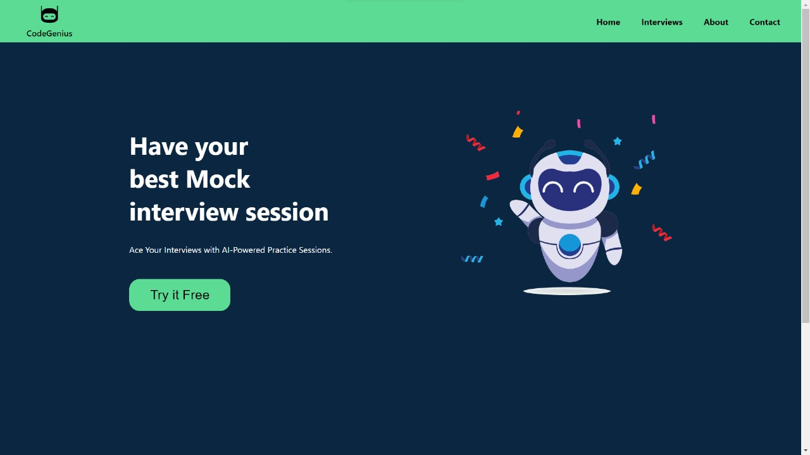
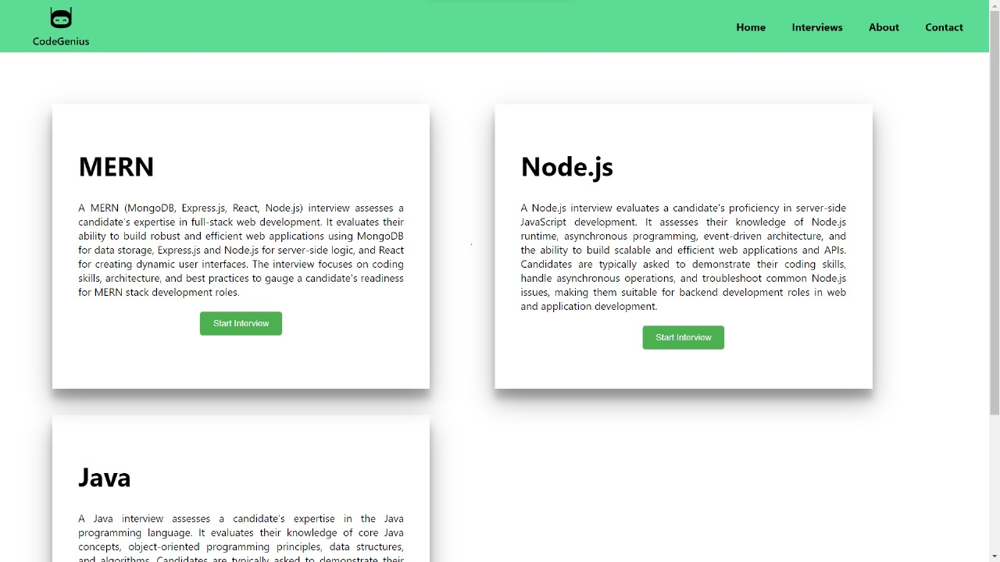
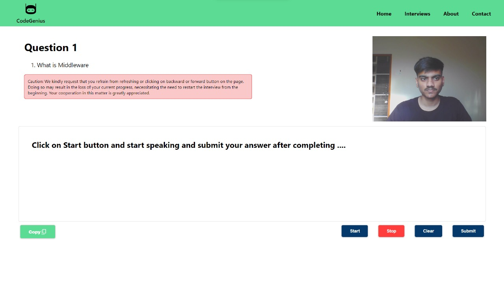
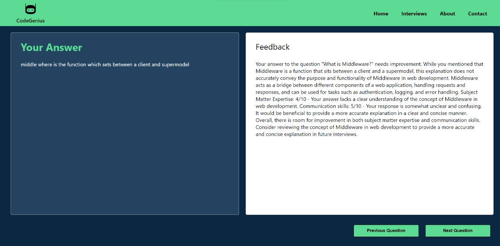

# CodeGenius
# AI Interview Preparation Platform

We are developing an AI-powered self-interview preparation platform. This platform leverages the power of AI and natural language processing to simulate real interview scenarios, providing users with valuable feedback and resources to enhance their interview skills.

## Key Features
## UI Pages

- [Home Page](ui_pages/homepage.jpeg)

- [Interview Selection Page](ui_pages/interview_selection.jpeg)

- [Practice Interview Page](ui_pages/progress.jpeg)

- [Feedback and Analysis Page](ui_pages/feedback.jpeg)

### Interview Simulator

- Our platform allows students to practice for interviews by engaging in realistic conversations with an AI interviewer, powered by the [OpenAI API](https://openai.com/product#made-for-developers). If you're new to OpenAI API, you can get started [here](https://www.builder.io/blog/stream-ai-javascript).
- Users can choose the type of interview they want to practice, such as MERN, Node, or Java, and receive a series of relevant questions.
- The OpenAI API dynamically generates questions and provides appropriate responses based on student answers.
- The AI adapts its tone and style of questioning to simulate different interviewer behaviors, depending on the type of interview selected.
- We aim to provide a communicative interview experience by utilizing text-to-speech libraries, taking inspiration from the Masai VI platform.

### Personalized Feedback

- Our platform utilizes AI to analyze students' interview responses and offers constructive feedback.
- Feedback covers various aspects, including content, delivery, and overall performance of student answers.
- Strengths and areas for improvement are highlighted, such as communication skills, technical knowledge, or problem-solving abilities.

### User-Friendly Interface

- We prioritize a user-friendly web or mobile interface that is intuitive, visually appealing, and easy to navigate.
- Our goal is to ensure a seamless experience for users, allowing them to focus on interview preparation without encountering technical issues.

## Tech Stacks to Be Used

- **Frontend**: React with Typescript (Mandatory)
- **Styling**: Tailwind CSS (Mandatory)
- **AI Integration**: OpenAI API (If you're new to OpenAI API, check out this [guide](https://www.builder.io/blog/stream-ai-javascript))
- **Data Visualization and Insights**: Charts (optional)
- **Backend Options**: Node.js with Express and MongoDB or Java Spring Boot

## Team Composition

- Each team will consist of 5 members.

### Team Members

- [Devesh](https://github.com/member1)
- [Nikhil Kumar](https://github.com/member2)
- [Satya Indra](https://github.com/member3)
- [Akash mishra](https://github.com/member3)

## Getting Started

To get started with the development of this platform, follow these steps:

1. Clone this repository to your local machine.
2. Set up the required development environment, including React, Tailwind CSS, and the OpenAI API.
3. Start building and contributing to the project.

## License

This project is licensed under the [MIT License](LICENSE).

Happy coding!
